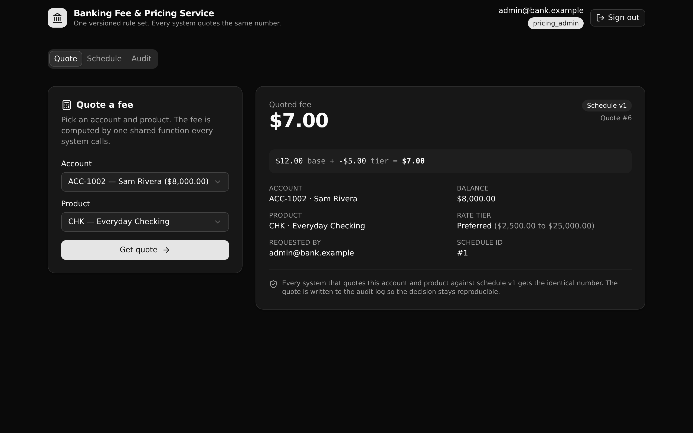

# Banking Fee & Pricing Service

**One versioned rule set computes every account fee, so a bank's statement engine, online banking app, and support tools all quote the same number from one governed endpoint.**

This is a Xano backend, authored in TypeScript with [`@xanots/sdk`](https://www.npmjs.com/package/@xanots/sdk), plus a React frontend that reads its paths and types from the same defs. It demonstrates **Business Logic Centralization** (Xano Play 1) for **banking**: the pricing rule lives in one place a technical reviewer can read, version, and audit, instead of being copied into every system that needs a fee.



**6 tables · 10 APIs · 1 shared function · 3 API groups.** Runs on seed data, no external credentials.

## What it demonstrates

Most banks copy fee logic into each app that needs it. The copies drift, and no one can say which number is correct. This service moves the rule into one governed calculation:

- A **versioned fee schedule** per product is the governance surface. Exactly one version is active at a time.
- A **rate tier** inside the schedule adjusts the base fee by the account's balance band.
- One **shared function**, `compute_quote`, resolves the active schedule, selects the tier, computes the fee, and writes an audit row. The quote endpoint and the seed routine both call it, so there is no second copy to drift.
- Every quote is written to an **immutable log** with the schedule version and tier that were applied, so a past decision stays reproducible even after the schedule is retired and a new version is published.
- Access is **API-layer RBAC**. A `pricing_admin` can publish and retire schedules; a `pricing_viewer` can read and quote. Permissions are enforced at the endpoint, never as row-level security.

An Enterprise Architect can open this repo, run it, and point at the one function that every system shares.

## Repo layout

```
xano/
  index.ts                 the workspace, registering everything
  tables/                  users, products, fee_schedules, rate_tiers, accounts, quote_log
  functions/compute-quote.ts   the one governed fee calculation
  api/
    groups.ts              the auth / pricing / seed API groups (pinned canonicals)
    login.ts, me.ts        native auth (token + caller)
    quote.ts               POST a quote (delegates to compute_quote)
    schedule-get.ts        a product's active schedule + tiers + any draft
    quote-get.ts           replay one past quote
    audit.ts               the filterable quote history
    publish.ts             the publish/retire state machine (admin only)
    lookups.ts             products + accounts for the UI
    seed-run.ts, seed-status.ts   demo data + self-seed check
  xano.lock                pinned object identities (committed)
frontend/                  React + Vite + Tailwind v4 + shadcn/ui
  src/lib/api.ts           the one contract: paths + types from the query defs
  src/components/          Login, Quote, Schedule, Audit screens
```

## API surface

All paths are `/api:<group>/<name>`. Protected endpoints take an `Authorization: Bearer <token>` header.

| Method | Path | Access | What it enforces |
| --- | --- | --- | --- |
| POST | `/api:auth/login` | public | Email and password to a bearer token. |
| GET | `/api:auth/me` | any role | The caller's identity and role. |
| POST | `/api:pricing/quote` | any role | Computes a fee through `compute_quote` and logs it. Rejects a product with no active schedule, rather than returning zero. |
| GET | `/api:pricing/schedule/{product_id}` | any role | The active schedule with its ordered tiers, plus any draft. |
| GET | `/api:pricing/quote/{id}` | any role | Replays one past quote with the version and tier applied at quote time. |
| GET | `/api:pricing/audit` | any role | The quote history, filterable by account, product, and date range. |
| POST | `/api:pricing/schedule/publish` | pricing_admin | Activates a draft and retires the current active, so exactly one version is active. |
| GET | `/api:pricing/lookups` | any role | Products and accounts for the UI selectors. |
| GET | `/api:seed/run` | public | Rebuilds the demo data (idempotent). |
| GET | `/api:seed/status` | public | Row counts, so the frontend self-seeds a fresh environment. |

## Quick start

You need a free [Xano](https://xano.com) account. Then, from a clone:

```bash
git clone https://github.com/xano-scratch/banking-fee-pricing-service
cd banking-fee-pricing-service
npm install
npx xanots login        # one-time browser auth with your Xano account
npm run xano:deploy     # builds the frontend, deploys the backend, prints a live URL
```

`xano:deploy` ships the backend and the built frontend to one disposable Xano environment and prints its URL. Open that URL, and the app seeds itself on first load. Sign in with a demo account:

- `admin@bank.example` / `admin-pass-123` (a pricing_admin, can publish)
- `viewer@bank.example` / `viewer-pass-123` (a pricing_viewer, read and quote only)

Other scripts: `npm run typecheck` (tsc), `npm run build` (frontend), `npm run xano:export` (compile the backend to `workspace.json`), `npm run dev` (frontend against `VITE_XANO_HOST`).

## The one contract

`frontend/src/lib/api.ts` derives every request path and type from the backend query defs with `getPath()`, `InferInput`, and `InferResponse`. There are no hand-typed URLs and no hand-mirrored response shapes. Change a def, and the frontend follows or fails to compile. The quote screen even types its result from the shared `compute_quote` function the endpoint relays, so the client and the server read one shape.

## FAQ

**Is this row-level security?** No. Access is checked at the API layer with role preconditions on each endpoint. That is how Xano models permissions.

**Where does the fee math live?** In `xano/functions/compute-quote.ts`. The quote endpoint and the seed routine both call it, which is the whole point: one rule, one place.

**How do old quotes stay correct after a price change?** Each quote row stores the schedule version, base fee, tier adjustment, and final fee at quote time. Publishing a new version does not touch past rows.

**Can I change the schema?** Yes. Edit the defs under `xano/`, run `npm run typecheck`, and `npm run xano:deploy` again. `xano/xano.lock` keeps object identities stable across renames.

## License

MIT. See [LICENSE](LICENSE).
